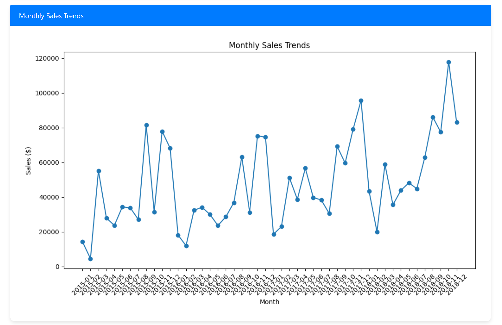
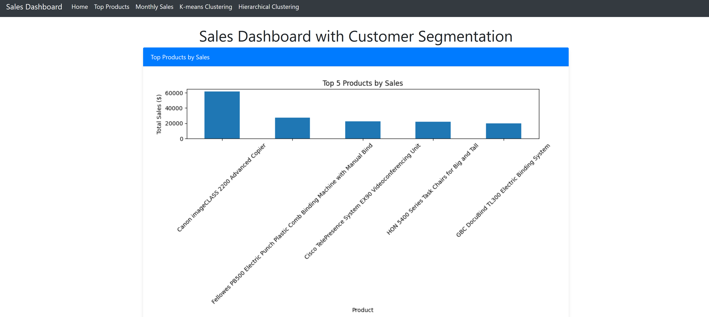
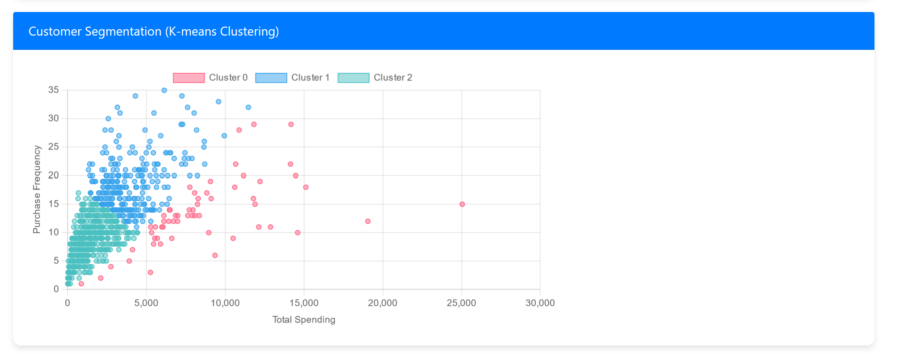
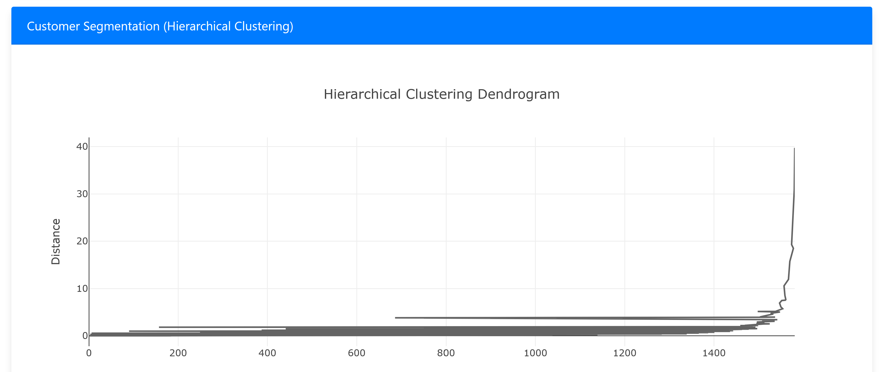

# Sales Data Analysis and Customer Segmentation Dashboard

## Project Description
This project involves analyzing sales data to track key metrics such as total sales, monthly trends, and product performance. Additionally, it includes customer segmentation using k-means and hierarchical clustering to identify different customer segments based on their purchasing behavior. The data analysis and visualizations are displayed through a professional, attractive, and responsive Flask web application.

## Table of Contents
- [Project Description](#project-description)
- [Features](#features)
- [Installation](#installation)
- [Usage](#usage)
- [Data](#data)
- [Results](#results)
- [Contributing](#contributing)
- [License](#license)

## Features
- Sales Data Analysis
- Monthly Sales Trends Visualization
- Top Products by Sales Visualization
- Customer Segmentation using K-means Clustering
- Customer Segmentation using Hierarchical Clustering
- Professional and Responsive Web Dashboard

## Installation
1. Clone the repository:
   ```bash
   git clone https://github.com/your-username/sales-data-analysis-dashboard.git
   cd sales-data-analysis-dashboard
   ```
2. Create and activate a virtual environment:
   ```bash
   python -m venv env
   source env/bin/activate  # On Windows use `env\Scripts\activate`
   ```
3. Install the required packages:
   ```bash
   pip install -r requirements.txt
   ```
## Usage
1. Place your sales data CSV file in the `data/` directory.
2. Run the Flask application:
   ```bash
   python app.py
   ```
3. Open your web browser and go to `http://127.0.0.1:5000/` to view the dashboard.

## Data
The sales data should be in CSV format with the following columns:
- `Row ID`
- `Order ID`
- `Order Date`
- `Ship Date`
- `Ship Mode`
- `Customer ID`
- `Customer Name`
- `Segment`
- `Country`
- `City`
- `State`
- `Postal Code`
- `Region`
- `Product ID`
- `Category`
- `Sub-Category`
- `Product Name`
- `Sales`

## Results
### Monthly Sales Trends


### Top Products by Sales


### Customer Segmentation (K-means Clustering)


### Customer Segmentation (Hierarchical Clustering)



## Contributing
Contributions are welcome! Please open an issue or submit a pull request for any changes or improvements.

## License
This project is licensed under the MIT License - see the [LICENSE](LICENSE) file for details.

